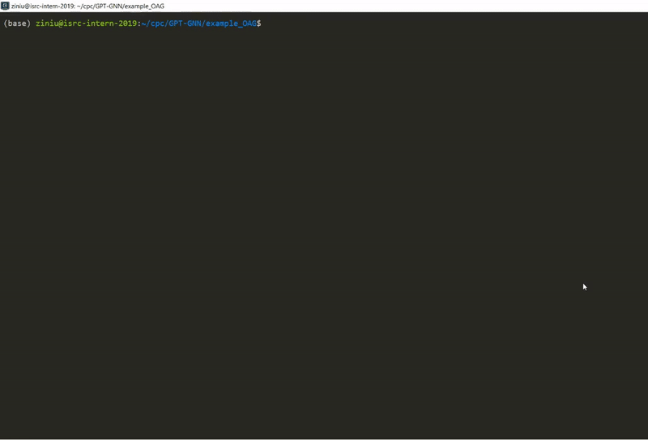

# GPT-GNN: Generative Pre-Training of Graph Neural Networks

<p align="center">
  
  <br />
  <br />
</p>


GPT-GNN is a pre-training framework to initialize GNNs by generative pre-training. It can be applied to large-scale and heterogensous graphs.

You can see our KDD 2020 paper [“**Generative Pre-Training of Graph Neural Networks**”](https://arxiv.org/pdf/2006.15437.pdf) for more details.


## Overview
The key package is GPT_GNN, which contains the the high-level GPT-GNN pretraining framework, base GNN models, and base graph structure and data loader.

To illustrate how to apply the GPT_GNN framework for arbitrary graphs, we provide examples of pre-training on both hetergeneous (OAG) and homogeneous graphs (reddit). Both of them are of large-scale.

Within each `example_*` package, there is a `pretrain_*.py` file for pre-training a GNN on the given graph, and also multiple `finetune_*.py` files for training and validating on downstream tasks.

## DataSet
For **Open Academic Graph (OAG)**, we provide a heterogeneous graph containing highly-cited CS papers (8.1G) spanning from 1900-2020. You can download the preprocessed graph via this [link](https://drive.google.com/open?id=1a85skqsMBwnJ151QpurLFSa9o2ymc_rq). We split the data by their time: Pre-training ( t < 2014 ); Training ( 2014 <= t < 2017); Validation ( t = 2017 ); Testing ( 2018 <= t ).

If you want to directly process from raw data, you can download via this [link](https://drive.google.com/open?id=1yDdVaartOCOSsQlUZs8cJcAUhmvRiBSz). After downloading it, run `preprocess_OAG.py` to extract features and store them in our data structure. 

For **Reddit**, we simply download the preprocessed graph using pyG.datasets API, and then turn it into our own data structure using `preprocess_reddit.py`. We randomly split the data into different sets.

## Usage
We first introduce the arguments to control hyperparameters. There are mainly three types of arguments, for pre-training; for dataset; for model and optimization.

For pre-training, we provide arguments to control different modules for attribute and edge generation tasks:
```
  --attr_ratio                     FLOAT   The ratio (0~1) of attribute generation loss .       Default is 0.5.
  --attr_type                      STR     type of attribute decoder ['text' or 'vec']          Default is 'vec'
  --neg_samp_num                   INT     Whether to use layer-norm on the last layer.         Default is False.
  --queue_size                     INT     Max size of adaptive embedding queue.                Default is 256.
```  

For datasets, we provide arguments to control mini-batch sampling:
```
  --data_dir                       STR     The address of preprocessed graph.
  --pretrain_model_dir             STR     The address for storing the pre-trained models.
  --sample_depth                   INT     How many layers within a mini-batch subgraph         Default is 6.
  --sample_width                   INT     How many nodes to be sampled per layer per type      Default is 128.
```  

For both pre-training and fine-tuning, we provide arguments to control model and optimizer hyperparameters. We highlight some key arguments below:

```
  --conv_name                      STR     Name of GNN filter (model)                           Default is hgt.
  --scheduler                      STR     Name of learning rate scheduler                      Default is cycle (for pretrain) and cosine (for fine-tuning)
  --n_hid                          INT     Number of hidden dimension                           Default is 400.
  --n_layers                       INT     Number of GNN layers                                 Default is 3.
  --prev_norm                      BOOL    Whether to use layer-norm on previous layers.        Default is False.
  --last_norm                      BOOL    Whether to use layer-norm on the last layer.         Default is False.
  --max_lr                         FLOAT   Maximum learning rate.                               Default is 1e-3 (for pretrain) and 5e-4 (for fine-tuning).  
```

The following commands pretrain a 3-layer HGT over OAG-CS:
<p align="center">
  
</p>

## Pre-trained Models

Coming soon.


### Reference

Please consider citing the following paper when using our code for your application.

```bibtex
@inproceedings{gpt_gnn,
  title={GPT-GNN: Generative Pre-Training of Graph Neural Networks},
  author={Ziniu Hu and Yuxiao Dong and Kuansan Wang and Kai-Wei Chang and Yizhou Sun},
  booktitle={Proceedings of the 26th ACM SIGKDD Conference on Knowledge Discovery and Data Mining},
  year={2020}
}
```


This implementation is mainly based on [pyHGT](https://github.com/acbull/pyHGT) API.
